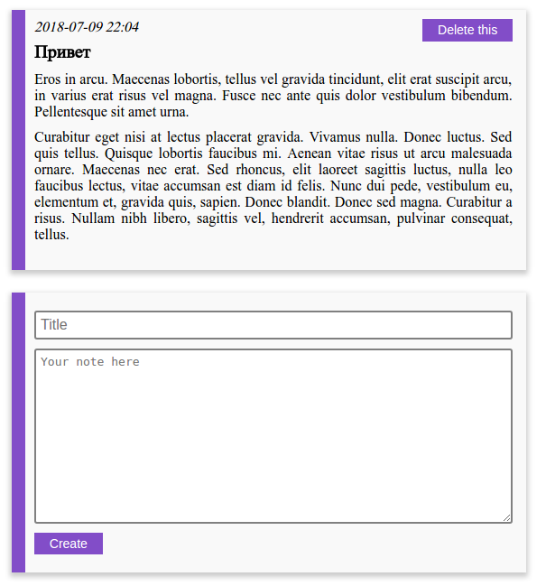

# Notes App

Python web app to store your notes. It starts as educational project for my gf, that's why I do it from scratch, without web frameworks, let's see what will it become.

Now it looks like this:

